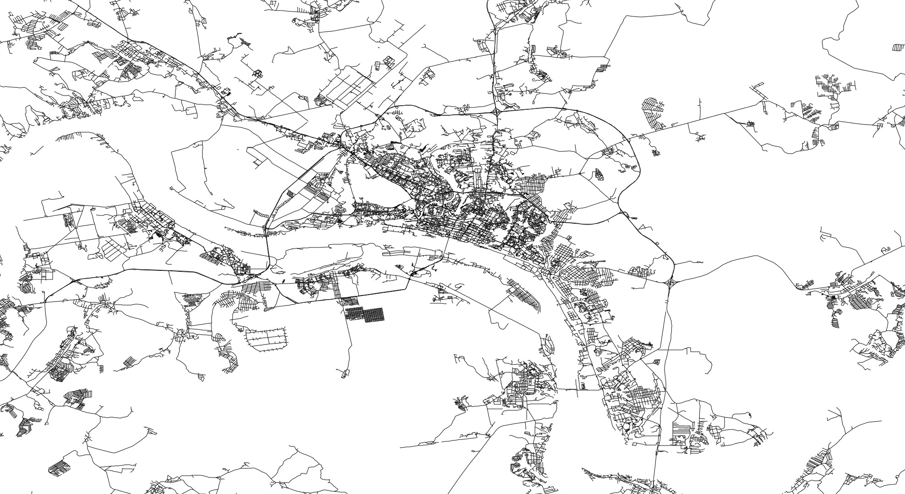

# Граф дорог города Пермь
Построение графа дорог и визуализация данных на основе OpenStreetMap
# Использование
Для запуска скрипта необходим Python версии 3.x, с установленным пакетом lxml.
Для установки пакета выполните комманду:
```
python -m pip install lxml
```
Для запуска построения списка смежности и svg визуализации запустите скрипт graph.py
(Перед этим поместив файл карты города в формате .osm в папку со скриптом, назовите файл map.osm)
```
python ./graph.py
```
Если дополнительно нужно построить матрицу смежности (осторожно, размер ~29GB!) запустите скрипт graph_with_AdjMatrix.py
```
python ./graph_with_AdjMatrix.py
```
Результаты будут выведены в папку /result
Так же в репозиторий уже включены некоторые результаты.
Скрипт graph.py также создает файл graph.pickle в папке result, этот файл необходим для работы скрипта interface.py
# Визуализация — результаты

# Интерфейс ползователя и вторая часть задания
После запуска скрипта graph.py создается файл /result/graph.pickle, если этот файл существует, то можно запускать скрипт interface.py (так же необходим файл map.osm).
В интерфейсе пользователя выберите тип объектов назначения (например hospital) и нажмите кнопку "Выбрать объекты". После этого подрузятся объекты заданного типа из файла map.osm, далее вы можете выбрать любое количество требуемых объектов назначения и подтвердить выбор, затем ввести координаты точки начала и нажать "Создать CSV и SVG" после этого будет найдена ближайшая точка на графе к введенным координатам. Все действия пользователя логируются в окне коммандной строки.
# Файл карты города map.osm 
Скачайте файл map.osm и поместите его в одну папку с graph.py.
Файл скачивайте [по этой ссылке](https://drive.google.com/open?id=1OpXkZcwq-bJswCqCbswAs9JbeX8xacch)
